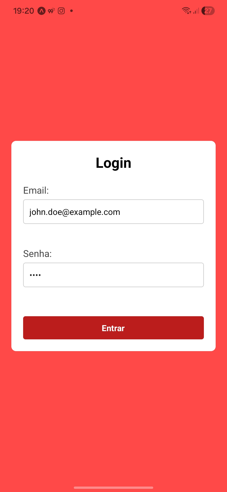
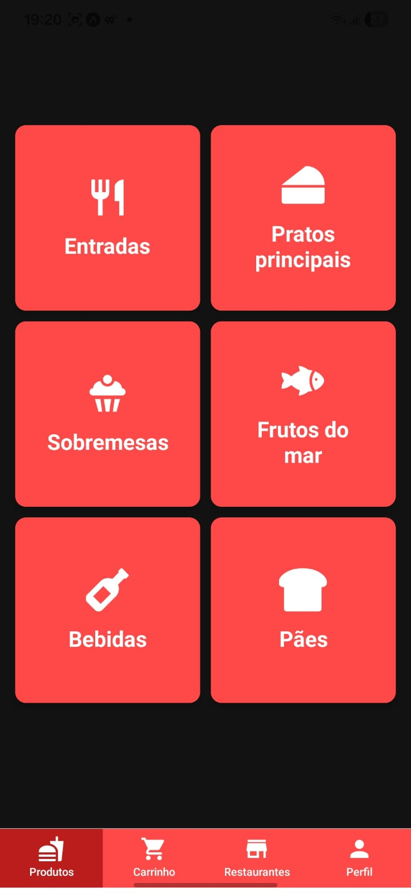
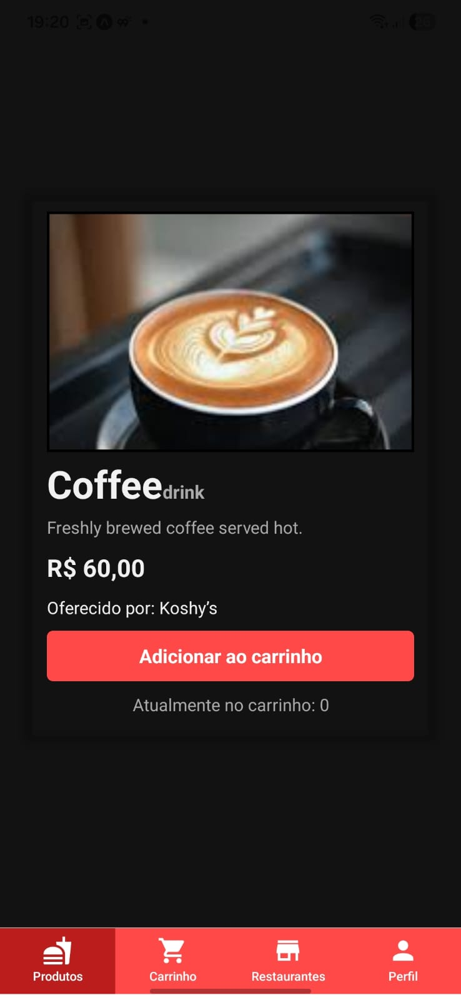
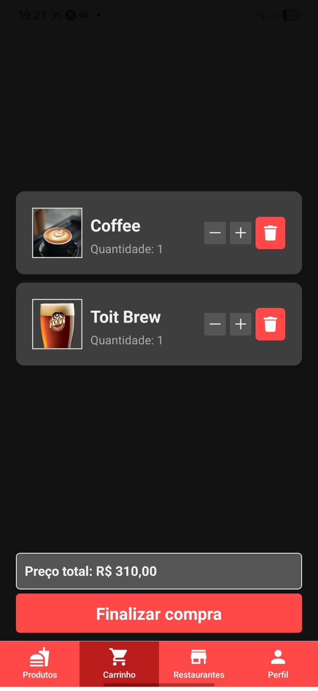
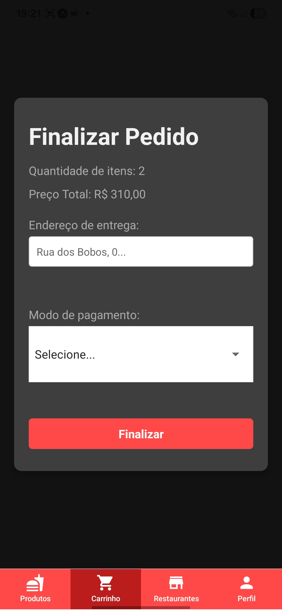

# 📱 Food Delivery App (Expo)

Aplicação mobile desenvolvida com **React Native + Expo**, simulando um fluxo de pedidos em um app de delivery de comida.

---

## 🚀 Funcionalidades

- 📋 Listagem de produtos
- 🔍 Visualização de detalhes
- 🛒 Carrinho de compras
- 💳 Finalização de pedido
- 🔔 Notificações locais (Expo Notifications)
- 🌙 Tema claro/escuro

---

## 🛠️ Tecnologias utilizadas

- React Native
- Expo
- React Navigation
- Context API
- Expo Notifications

---

## 📂 Estrutura do projeto

```
📦 root
 ┣ 📂 assets        # Imagens e arquivos estáticos
 ┣ 📂 clients       # Configurações de cliente/API
 ┣ 📂 components    # Componentes reutilizáveis
 ┣ 📂 mocks         # Dados mockados (produtos, usuários)
 ┣ 📂 routers       # Configuração de rotas/navegação
 ┣ 📂 storage       # Persistência/local storage
 ┣ 📜 App.js        # Arquivo principal
 ┣ 📜 index.js      # Entry point
 ┣ 📜 app.json      # Configuração do Expo
 ┣ 📜 package.json  # Dependências
```

---

## ⚙️ Pré-requisitos

Antes de rodar o projeto, você precisa ter instalado:

- Node.js
- Expo CLI

Instalar Expo CLI:

```bash
npm install -g expo-cli
```

---

## ▶️ Como executar o projeto

1. Clone o repositório:

```bash
git clone https://github.com/seu-usuario/seu-repo.git
```

2. Acesse a pasta:

```bash
cd seu-repo
```

3. Instale as dependências:

```bash
npm install
```

4. Inicie o projeto:

```bash
npx expo start
```

---

## 📱 Rodando no dispositivo

Você pode rodar o app de 3 formas:

- 📲 App Expo Go (Android/iOS)
- 🤖 Emulador Android
- 🍎 Simulador iOS

---

## 🔔 Notificações

O app utiliza **Expo Notifications**, então:

- Em dispositivos físicos: funciona normalmente
- Em emuladores: pode não funcionar corretamente

---

## 📸 Screenshots

### 🙍🏻‍♂️ Login


### 🏠 Tela inicial


### 🍔 Detalhes do produto


### 🛒 Carrinho


### 💳 Checkout


---

## 📦 Build para produção

Para gerar build do app:

```bash
npx expo prebuild
npx expo run:android
```

Ou usando EAS:

```bash
npm install -g eas-cli
eas build
```

## 👨‍💻 Autor

Pedro Viana Castilhos

---

## 📄 Licença

Este projeto é apenas para fins educacionais.

